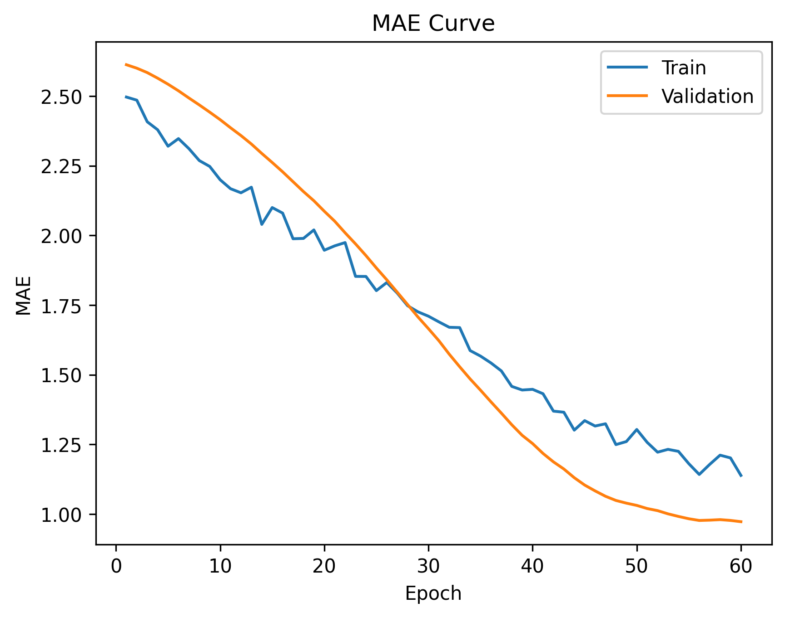
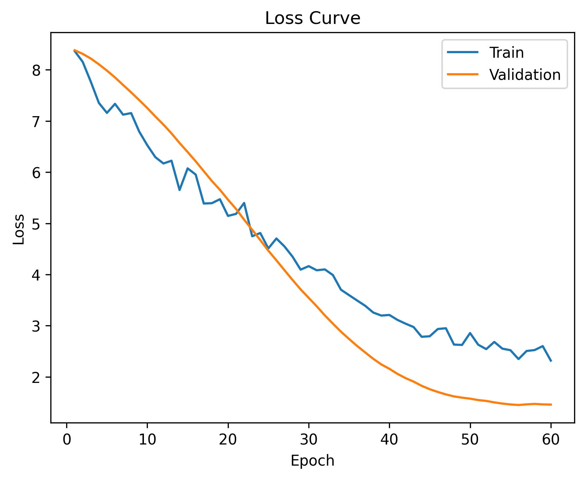
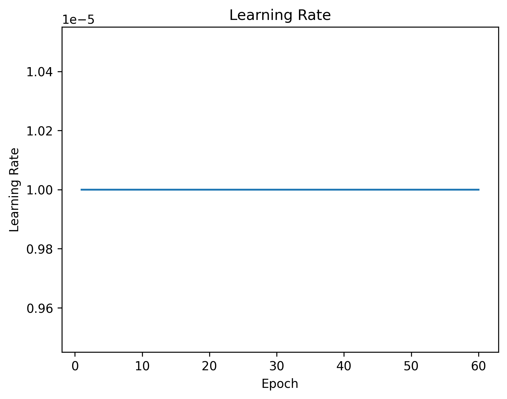

# 🌱 CSIROS Biomass Prediction (Kaggle)

This project predicts pasture biomass components using a **multi-modal deep learning model**
that combines **RGB images** and **numeric vegetation indices**.

## 🚀 Features
- EfficientNet-based CNN (trained from scratch)
- Numeric features: NDVI & canopy height
- Physics-aware loss (Dry_Total constraint)
- Log-scaled targets
- Kaggle-safe (no internet, no pretrained weights)

## 🧠 Model Inputs
- RGB pasture images
- Pre_GSHH_NDVI
- Height_Ave_cm

## 📊 Targets
- Dry_Clover_g
- Dry_Dead_g
- Dry_Green_g
- Dry_Total_g
- GDM_g

## 🏗️ Training Strategy
- Image augmentation
- Physics-aware loss
- End-to-end training
- GPU-accelerated (Tesla T4)

## 📂 Repository Structure

## 🏁 Kaggle Submission
The notebook generates `submission.csv` automatically at the end of execution.

## ⚠️ Notes
- Dataset not included (Kaggle competition rules)
- Internet disabled for reproducibility
---
## 📊 Figure Preview

---
Conclusion

The training results demonstrate that the model is robust, well-optimized, and generalizes effectively.
The consistent behavior across loss and MAE metrics confirms the reliability of the training pipeline and the suitability of the chosen architecture and hyperparameters.

This model is ready for evaluation, deployment, or further fine-tuning
---

### 👤 Author
Saurabh Raj Varma

